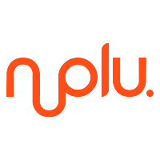

<h1 align="center">
  
</h1>

<h3 align="center">
  Brinquedaria Nolu
</h3>
<p align = "center">
Teste Prático para Desenvolvedor Back-End - Nolu Tecnologia
</p>

### :information_source: Instruções

Para clonar esse app voce precisa [Git](https://git-scm.com), [Node.js v10.16](https://nodejs.org/) + [Yarn](https://yarnpkg.com/). Para ele poder funcionar precisa de um banco [MySql](https://www.mysql.com/) instalado e rodando na maquina <details><summary>podendo utilizar o [Docker](https://www.docker.com/).</summary>
```bash
# instalar mysql
docker run -d -p 3306:3306 --name nolu-mysql -e MYSQL_ROOT_PASSWORD=mysql -d mysql:latest

# inicializar mysql
docker start nolu-mysql
```
</details>

```bash
# clone o arquivo do repositório
git clone https://github.com/glayner/brinquedariaNolu.git

# entrar na pasta do back-end
cd brinquedariaNolu

#instalar os pacotes e dependencias
yarn install

```
Faça uma cópia do arquivo .env.example, renomeie para .env e altere as variáveis de acordo com o seu ambiente.
```bash
# criar estrutura do banco de dados mysql
yarn sequelize db:migrate

# povoar o banco de dados
yarn sequelize db:seed:all

# iniciar servidor da aplicação
yarn dev

```

### Tecnologias utilizadas

1) Dependencias de desenvolvimento
- Eslint, Prettier e EditorConfig: Para padronização de codigo e estilização ;
- Nodemon e Sucrase: Para restart automatico do servidor e habilitar import/export.

2) Dependencias de produção
- Cors e Helmet: Para segurança servindo para habilitar qual front-end pode acessar a api e  um middleware com proteções automaticas e heads da resposta;
- Yup: Para fazer a validação das entradas;
- Dotenv: Para gerenciar variaveis de ambiente;
- Sequelize: ORM (Object-Relational Mapper) para Node.
- Express e Mysql2.

## :clap: Obrigado

Agradeço à [NOLU Tecnologia](https://www.linkedin.com/company/nolu-tecnologia/) pela oportunidade.
